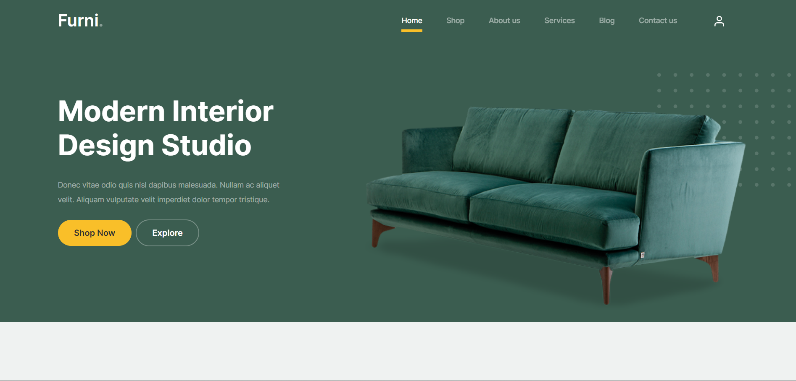

# Furni - E-commerce Website
# Home


## Description
This is a simple e-commerce website that allows users to view products, add them to their cart, and checkout. 
The website is built using Laravel and Bootstrap.

## Features
- View products
- Add products to cart
- Checkout using Stripe
- View product details
- Authentication
- Some Api's
- more ...
<hr>

## Config
- Goto `.env` File Put Your DB Configuration
```
DB_DATABASE='Your-DB-NAME'
DB_USERNAME='DB-Username'
DB_PASSWORD='DB-Password'
```
- Sign up in `Mailtrip`
- Put Your Mailtrip Configuration

```
MAIL_MAILER='Here'
MAIL_HOST='Here'
MAIL_PORT='Here'
MAIL_USERNAME='Here'
MAIL_PASSWORD='Here'
```
Run Migration With Seeding
```
php artisan migrate --seed
```

Now Launch

```
php artisan serve 
```
## Future Feature
- Improve More components
- Add More Api's
- Add Admin Panel

